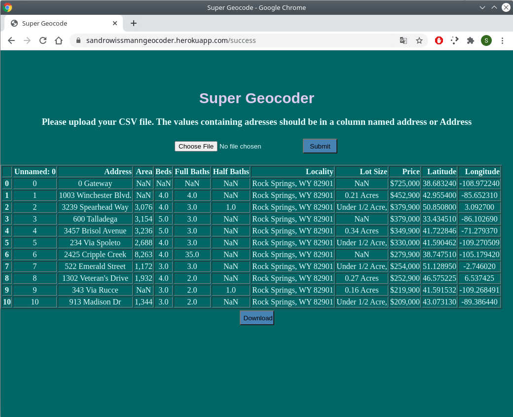

# Super Geocoder

[Try it out here](https://sandrowissmanngeocoder.herokuapp.com/)

## Features

* Upload a .CSV file with addresses to the webserver
* The webserver calculates the geographical coordinates of the addresses (latitude and longitude)
* Download a new .CSV file with the added geographical coordinates.

## How to run locally

All steps described in this section were done in a Linux environment. 
On Windows / Mac the commands might be slighty different

* Python 3 requird (tested with Python 3.6.9) 

* Create and activate virtual environment:
  * install virtualenv: `pip3 install virtualenv`
  * move to main directory were `app.py` is located
  * create environment: `virtualenv virtual`
  * activate environment: `source virtual/bin/activate`

* Install python packages:
  * flask: `pip3 install flask`
  * werkzeug: `pip3 install werkzeug`
  * geopy: `pip3 install geopy`
  * pandas: `pip3 install pandas`

* Start the Server:
  * In activated environment: `python3 app.py`
  * Open a webbrowser and go to: `http://localhost:5000/`

## How to to deploy to Heroku Server

To upload the app into the web I used Heroku. The following section describes the additionally steps involved to get upload the app to Heroku.

All steps involving python should be done in the virtual environment.

* Delete local git repository:
  * This is necessary because the Heroku Server will sync with this project
  * In the main folder of the project do `rm -rf .git`

* Install gunicorn:
  * `pip3 install gunicorn`

* Generate the file `requirements.txt`:
  * `pip3 freeze > requirements.txt`
  * The file `requirements.txt` has to go in the folder of app.py

* Create the file `runtime.txt`:
  * Create the file in the folder of app.py.
  * The file should contain your python version like this: `python-3.6.9`

* Create the file `Procfile`:
  * Create the file in the folder of app.py
  * Important the filename must begin with capital letter. `procfile` won't work
  * It should contain:
    * `web: gunicorn app:app`

* Create an free account on `heroku.com`:
  * Choose hobby as account type. This gives you the option to have up to 5 apps 
  on heroku
  
* Install Heroku CLI:
  * Follow instructions [here](https://devcenter.heroku.com/articles/heroku-cli)

* Deploy webapp to Heroku
  * Open a terminal in the folder of `app.py`
  * Log into heroku with: 
    * `heroku login`
  * Create app: 
    * `heroku create appname`
    * replace `appname` with the name you want
    * check if it was successfull with 
      * `heroku apps`
  * Create git repo: 
    * `git init`
  * Add all files: 
    * `git add .`
  * commit: 
    * `git commit -m "first commit"`
  * link git repo with your app in heroku:
    * `heroku git:remote --app appname`
    * `appname` is the name you selected. See step Create app
  * upload webapp: 
    * `git push heroku master`
  * open uploaded webapp: 
    * `heroku open`